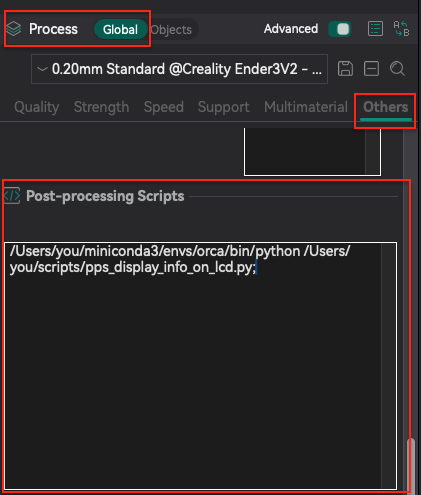

# Orca Slicer Post-Processing Script: Display Layer and ET on LCD

This script is a **post-processing script** for [Orca Slicer](https://github.com/SoftFever/OrcaSlicer), inspired by Cura's plugin "Display Info on LCD. It injects `M117` commands into the G-code to display the **current layer** and **estimated remaining time** on your 3D printer’s LCD screen during printing.

## ✨ Features

* Parses estimated print time and total layer count from G-code comments.
* Adds `M117` display messages before each layer change, like:

  ```
  M117 7/42 | ET 1h4m22s
  ```
* Helps monitor progress on printers with LCD displays (e.g. Marlin firmware).
* Logs activity to `pps_display_info_on_lcd.log` for debugging.

## 📥 Installation

1. Place the script (`pps_display_info_on_lcd.py`) in any directory.
2. In **Orca Slicer**:

   * Go to **Process > Global > Others > Post-processing Scripts**.
   * Add this script via the full path.
   * Orca will run it automatically after slicing.



### ✅ Examples:

#### If you're using a regular Python installation:

```bash
python /Users/you/scripts/pps_display_info_on_lcd.py;
```

```bash
python3 /Users/you/scripts/pps_display_info_on_lcd.py;
```

#### If you're using a Python virtual environment (e.g. Conda, miniconda, venv), you can specify the exact interpreter to use. For example:

```bash
/Users/you/miniconda3/envs/orca/bin/python /Users/you/scripts/pps_display_info_on_lcd.py;
```

> ⚠️ Make sure Python 3 is installed on your system and accessible from PATH or in a virtual environment.

## 🛠️ Usage (Manual CLI)

You can also run the script manually in a command line:

```bash
python pps_display_info_on_lcd.py /path/to/file.gcode
```

## 📄 Output Example

In your G-code file, before processing:

```gcode
;BEFORE_LAYER_CHANGE
G1 Z0.60
```

In your G-code file, after processing:

```gcode
;BEFORE_LAYER_CHANGE
M117 3/28 | ET 0h14m20s
G1 Z0.60
```

## 📁 Log File

A log file `pps_display_info_on_lcd.log` is generated in the same directory as the script, containing success/failure messages for parsing and injection steps.

## 🧪 Tested With

* Orca Slicer 2.3.0
* Marlin firmware
* G-code with comments like:

  * `; estimated printing time (normal mode) = 1h 12m 30s`
  * `; total layers count = 42`

## ⚖️ License

This script is licensed under the **GNU General Public License v3.0**.
See [LICENSE](https://www.gnu.org/licenses/gpl-3.0.html) for more details.

---

Copyright © 2025
Bruno Henrique
